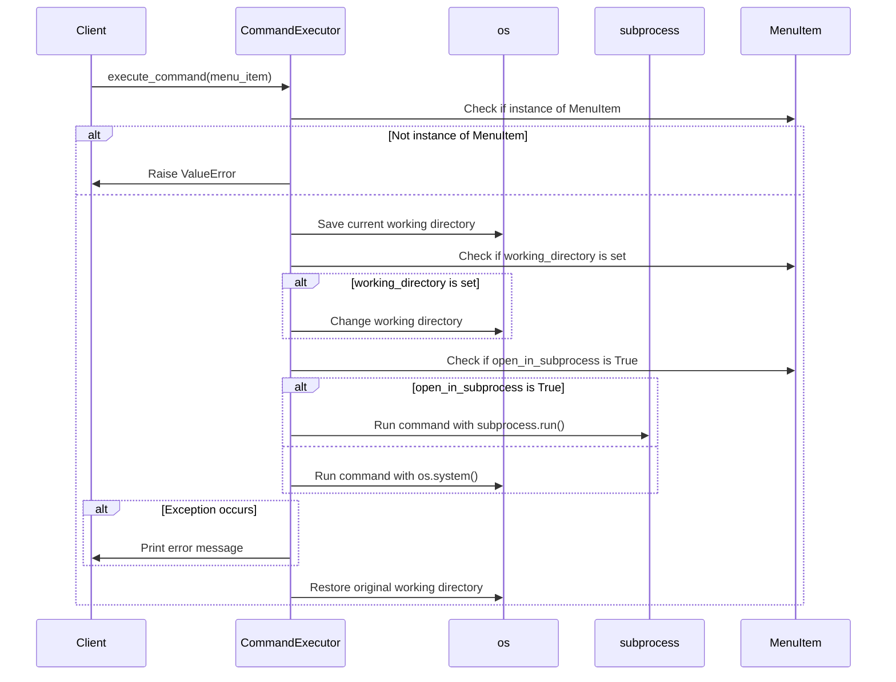

```mermaid
sequenceDiagram
    participant Client
    participant CommandExecutor
    participant os
    participant subprocess
    participant MenuItem

    Client->>CommandExecutor: execute_command(menu_item)
    CommandExecutor->>MenuItem: Check if instance of MenuItem
    alt Not instance of MenuItem
        CommandExecutor->>Client: Raise ValueError
    else
        CommandExecutor->>os: Save current working directory
        CommandExecutor->>MenuItem: Check if working_directory is set
        alt working_directory is set
            CommandExecutor->>os: Change working directory
        end
        CommandExecutor->>MenuItem: Check if open_in_subprocess is True
        alt open_in_subprocess is True
            CommandExecutor->>subprocess: Run command with subprocess.run()
        else
            CommandExecutor->>os: Run command with os.system()
        end
        alt Exception occurs
            CommandExecutor->>Client: Print error message
        end
        CommandExecutor->>os: Restore original working directory
    end
```
